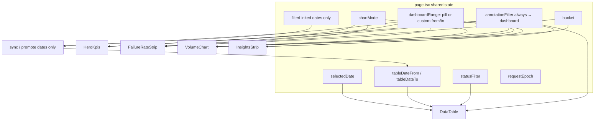
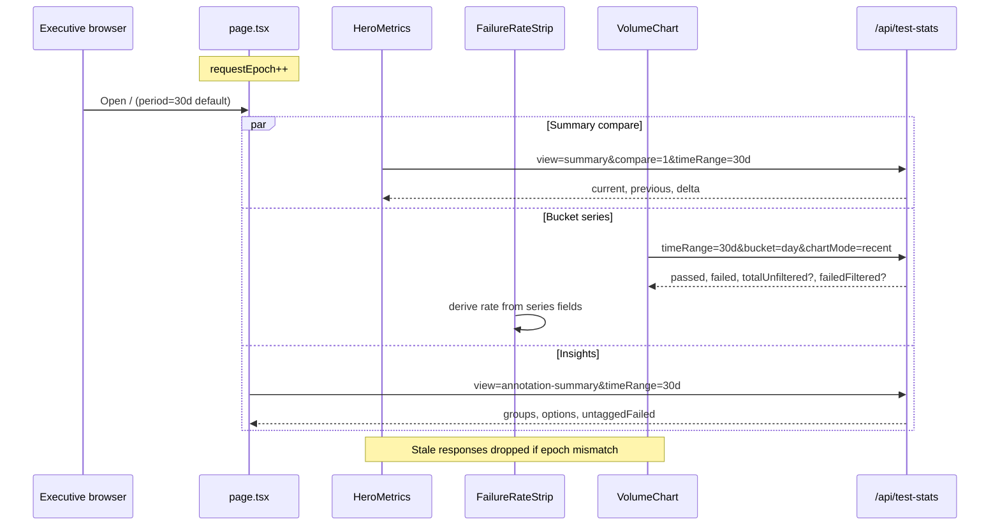
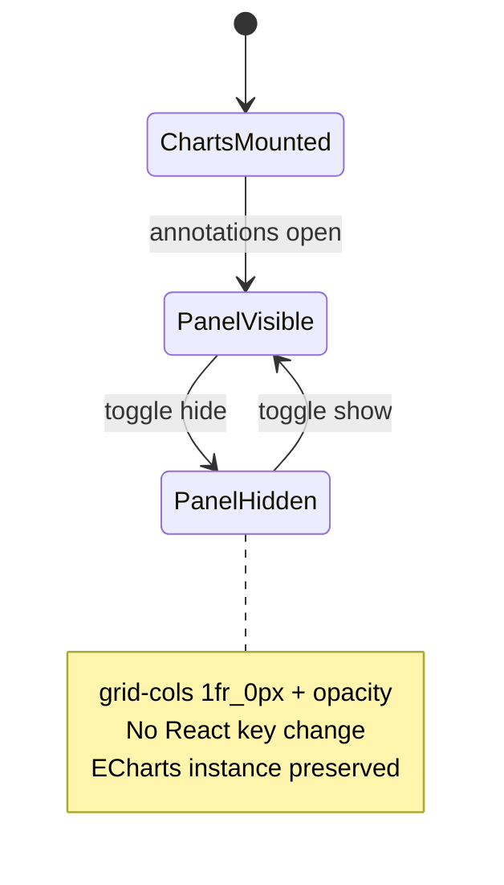
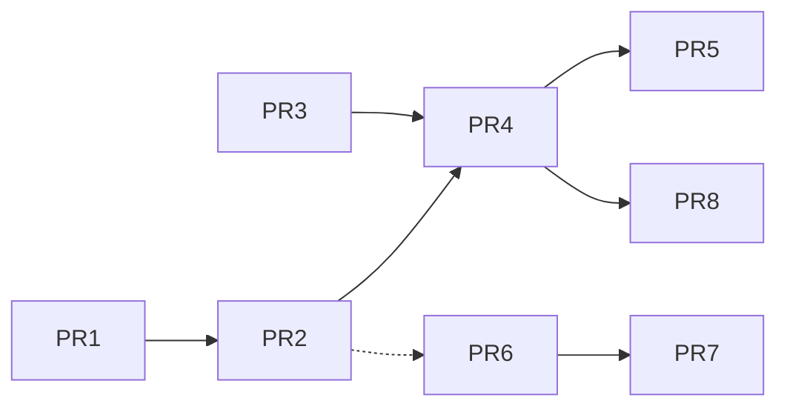

# Burnin Dashboard UI Overhaul (Executive-Focused)

| Field | Value |
|-------|-------|
| **Status** | Implemented on `grok/ui-refresh` (execute-plan ae4b7703, 2026-07-29) |
| **Author** | TBD |
| **Date** | 2026-07-28 |
| **Branch** | `grok/ui-refresh` (from `master`; clean baseline) |
| **Related prior work** | `fable/ui-refresh` (incremental refresh — cherry-pick then redesign) |
| **Repo** | `/home/devy/Documents/burnin` |
| **Primary audience** | CEO, CTO (non-power-users); secondary: engineering / lab ops |

---

## Overview

The Burnin Test Dashboard is a Next.js 15 application used by Sparq Systems leadership and engineering to monitor inverter burn-in outcomes. Today the main dashboard (`src/app/page.tsx`) is a stacked vertical layout of equal-weight KPI cards, a single-axis stacked area chart of passed+failed counts, and a dense filterable test table. Failures—the metric leadership cares about most—are visually flattened against much larger pass volumes. Time aggregation is hard-coded to daily buckets with fixed 7d/30d/90d/all windows. The individual test page (`src/app/test/[id]/page.tsx`, ~1800 lines) is feature-rich (ECharts telemetry, fullscreen, failure navigation, annotations) but sprawling and not optimized for fast root-cause annotation workflows.

This design proposes an **executive command-center** redesign of the main dashboard and a denser, annotations-first test detail experience. It adopts and then **goes beyond** the solid foundations already prototyped on `fable/ui-refresh` (dual-axis chart, day–year bucketing, richer KPI trends, annotations-first panel). The goal is answers at a glance—failure rate as the hero, volume and period comparison as supporting cast—with progressive disclosure for power filters, without changing auth or the core relational schema.

**Rev 2** locks metric semantics (annotation-filter rate strip, `chartMode=recent` hero vs chart), product defaults, DataTable controlled `statusFilter`, lightweight `annotation-summary` API, UTC PoP windows, and `bucketRange()` drill-down.

**Rev 3** locks four implementability gaps: **split dashboard vs table date state** + complete `filterLinked` rules; **strip API fields required in PR4** (not deferred); **`failedFiltered` = rank-then-tag (A)** with CTE sketch; **period-scoped untagged → `/todo?dateFrom=&dateTo=`**.

---

## Background & Motivation

### Current state (master)

| Area | Implementation | Pain |
|------|----------------|------|
| Main layout | `SectionCards` → `ChartAreaInteractive` → `DataTable` (`src/app/page.tsx`) | Equal visual weight; no narrative hierarchy for executives |
| KPIs | Four equal cards: total, passed, failed, failure rate (`section-cards.tsx`) | Failure rate not hero; no period-over-period |
| Chart | ECharts stacked area, single y-axis, daily only (`chart-area-interactive.tsx`) | Failures flattened; no week/month/quarter/year |
| Stats API | `/api/test-stats` views: `summary`, `tests`, `firmware-versions`, `annotations`; default = daily aggregates (`route.ts`) | No bucket param; no server-side comparison |
| Filters | chartMode (all\|recent), timeRange, annotation filter, date range cookies; chart↔table link toggle | Powerful but noisy; “All Tests / Latest per S/N” is jargon-forward |
| Test page | 3 chart groups + sticky annotations sidebar; remounts layout when sidebar toggles (`key={layout-${sidebarVisible}}`) | Low density header; annotations secondary; chart remount cost |
| Annotations | Groups, quick options, DnD, CRUD (`TestAnnotations.tsx` ~844 lines) | Manage UI competes with annotate-now workflow |
| Themes | `next-themes` + CSS vars in `globals.css` | Chart colors are ad-hoc HSL strings, not tokenized |

### Explicit product feedback

1. **Separate Y-axis for failed tests** — failures are small counts, high importance.
2. **Time bucketing**: day / week / month / quarter / year.
3. **Charts must feel beautiful** — chart experience is high priority.
4. Full authority to change chart rendering (including libraries).
5. Test page should be **more information dense**.
6. Annotations UI needs a nicer design (will play a large role soon).
7. **Go further than incremental polish** — redesign main dashboard IA for executives.
8. Make something beautiful.

### Primary users

CEO and CTO who:

- Want answers at a glance, not configuration panels.
- Care most about **failure rate** and **how many tests ran**.
- Want stats **bucketed by day / week / month / quarter / year**.
- Will increasingly rely on **annotations** for root-cause categorization.

### Prior work: `fable/ui-refresh`

Seven commits on top of an older master tip (~1.1k insertions across 9 files). Summary of what it already does well:

1. **Main dashboard**: `bucket` query param + `validateBucket`; dual-axis chart (passed = gradient bars left axis, failed = red line right axis); KPI icons + client-side prior-window trends.
2. **Test page**: dense metadata header (`MetaItem`), restyled charts (chip toggles, modern palette), compact failure nav strip.
3. **Annotations**: annotations-first layout, group-accented cards, quick-annotate chips, manage groups collapsed.
4. **Polish**: colored axis labels, empty-range graphic, bucket toggle, sidebar animate without remounting charts (`grid-cols-[1fr_0px]` + opacity).
5. **Side pages**: failure-analytics + contributors visual alignment.

**Adoption strategy (not freehand reimplementation):** Prefer **cherry-pick / adapt** of fable commits onto `grok/ui-refresh` for API+dual-axis (≈`250d31f`) and test/annotations polish (≈`17cab46`–`6b89d34`), then redesign IA on top in later PRs. Expect merge conflicts with newer master (ingest, stations, etc.)—resolve toward current master behavior for non-UI code; take fable hunks only for UI/stats surfaces listed in §8. Source-of-truth paths when porting:

| Surface | Fable path |
|---------|------------|
| Bucket validation | `src/lib/validation.ts` |
| DATE_TRUNC chart query | `src/app/api/test-stats/route.ts` |
| Dual-axis + formatBucketLabel | `src/components/chart-area-interactive.tsx` |
| TrendBadge (logic only; UI lands in hero) | `src/components/section-cards.tsx` |
| Dense test header / no remount | `src/app/test/[id]/page.tsx` |
| Annotations-first | `src/components/TestAnnotations.tsx` |

**Gaps vs executive goals (this design must close them):**

- Equal 4-card grid remains; failure rate is not a hero metric.
- Period comparison is a subtle badge (“vs prior 7 days”), not a first-class “this period vs last period” story.
- No **required** failure-rate trend strip separate from volume chart.
- Controls (mode, range, bucket, export) still crowd the chart card header—configuration-first, not answer-first.
- No server-side comparison payload with UTC-aligned windows.
- No lightweight dashboard annotation insights (top causes without full analytics timelines).
- No unified page-level period control with explicit table link rules.
- Does not redesign information architecture—still Cards → Chart → Table stack.
- Metric semantics under annotation filter and `chartMode=recent` are easy to misread; this design locks them (see Key Decisions).

---

## Goals & Non-Goals

### Goals

1. **Answer-first main dashboard** for non-technical executives: failure rate hero, volume secondary, period comparison always visible.
2. **Dual-axis pass/fail volume chart** with day–year buckets; beautiful tooltips, empty states, click-to-drill.
3. **Failure-rate trend** as a **required** dedicated visual (compact strip), not buried in the volume chart and not optional in the IA.
4. **Progressive disclosure**: simple default view; advanced filters (chart mode, custom dates, export, link toggle) available but not front-and-center; table owns row-level filters.
5. **Test detail density**: metadata band + charts + first-class annotations workflow.
6. **Annotations as primary workflow** for failure categorization (quick-annotate first, manage vocabulary second).
7. **Light + dark excellence** via design tokens (not one-off hex in components).
8. **Incremental PR plan** that can ship dual-axis + buckets early, then redesign layout.
9. Preserve auth model, cookie filter persistence where it still makes sense, and existing APIs’ semantics where compatible.
10. **Honest metric semantics**: hero, strip, and chart never silently disagree; captions explain when series are not summable.

### Non-Goals

- Schema migrations or changes to `Tests` / `TestAnnotations` tables (additive **indexes** may be an optional ops follow-up—not required for UI ship).
- Replacing NextAuth / Azure AD domain restriction.
- Full mobile-first redesign (responsive still required for occasional phone checks).
- Rebuilding failure-analytics or contributors pages beyond visual alignment (optional late PR).
- Real-time streaming / websocket telemetry (batch CSV ingest remains source of truth).
- Multi-tenant or role-based UI (all @sparqsys.com users see the same dashboard).
- Automated ML failure classification UI (out of scope; annotations remain human-driven).
- Making `/failure-analytics` the executive home page (see Alternatives A6).

---

## Executive UX Principles

These principles bind every design choice in this document.

| # | Principle | Implication |
|---|-----------|-------------|
| 1 | **Answer first** | Above the fold: “What is our failure rate, and is it better or worse?” Volume and table come second. |
| 2 | **Plain language** | Prefer “Latest result per inverter” over “Latest per S/N”; “Group chart by” over raw “Bucket”. |
| 3 | **Large touch targets** | Primary controls min **40–44px** height (`h-10`/`h-11`); period/bucket pills and More trigger meet this; avoid tiny icon-only critical actions. |
| 4 | **One primary period** | `dashboardRange` drives hero, strip, chart, insights. Table dates are a **separate store**; rebind/promote **only when `filterLinked`** (dates only—annotation always on). |
| 5 | **Color semantics** | Fail / attention = rose-red; pass / healthy = emerald; neutral volume = slate/primary. Never encode status only in color—pair with labels. |
| 6 | **Progressive disclosure** | Defaults are executive-safe. Mode, custom dates, link toggle, export live in page **More** sheet; table keeps serial/status/firmware/annotation/dates. |
| 7 | **Click to understand** | Chart bucket click filters the table; Failures hero sets controlled `statusFilter=FAIL` and scrolls to `#test-table`. No dead decoration. |
| 8 | **Stable layout** | Toggling side panels must not remount charts (preserve zoom/decimation)—fable `grid-cols-[1fr_0px]` pattern. |
| 9 | **Calm motion** | 150–250ms ease transitions for panels; no confetti, no continuous animation on numbers. |
| 10 | **Theme parity** | Every new surface designed and verified in light and dark (`next-themes`). |

### Definition of done (principles → PR acceptance)

| Principle | Done when |
|-----------|-----------|
| 1 Answer first | Failure rate is the largest number above the fold; PoP visible without opening More |
| 3 Touch targets | Period pills, bucket pills, More, Export: ≥40px hit area (QA checklist PR4) |
| 4 One period | `dashboardRange` change updates hero+strip+chart+insights; table dates update **iff** `filterLinked`; unlinked table edits never feed dashboard |
| 7 Click | Hero Failures → `statusFilter=FAIL` + scroll; day/bucket click → table dates; insight chip → `annotationFilter` |
| 8 Stable | Annotations toggle does not remount ECharts (no layout `key` flip) |
| 10 Theme | Light + dark screenshots 1920×1080 for hero, strip, dual-axis, test page, annotations |

---

## Proposed Design

### 1. Main dashboard information architecture

Redesign `src/app/page.tsx` from a flat stack into a **command center** with explicit hierarchy.

**Header composition:** On `/`, **replace** the visual role of `SiteHeader` with `DashboardHeader` (single title row—no stacked double titles). Keep page shell `ml-10` for `HoverSidebar`. Other routes may keep `SiteHeader` unchanged. `DashboardHeader` owns title (“Burn-in Command Center” or `SiteHeader`-equivalent string), **period pills**, **More** sheet trigger, and **Export** menu. Period **state** remains on `page.tsx` (already owns `timeRange`); PR2 does **not** move period UI to the header—chart-local timeRange stays until PR4.

```
┌──────────────────────────────────────────────────────────────────────────┐
│  DashboardHeader (replaces SiteHeader on /)                              │
│  “Burn-in Command Center”     [7d|30d|90d|All]  [More]  [Export ▾]      │
├──────────────────────────────────────────────────────────────────────────┤
│  HERO ROW                                                                │
│  ┌─────────────────────────────┐  ┌──────────────┐  ┌─────────────────┐ │
│  │  FAILURE RATE               │  │ Tests run    │  │ Failures        │ │
│  │  2.4%                       │  │ 1,284        │  │ 31              │ │
│  │  ▼ 0.6 pp vs prior period   │  │ +140 vs prior│  │ −8 vs prior     │ │
│  └─────────────────────────────┘  └──────────────┘  └─────────────────┘ │
├──────────────────────────────────────────────────────────────────────────┤
│  FAILURE-RATE STRIP (required, compact ~72–96px)                         │
│  % over same buckets as volume chart                                     │
├──────────────────────────────────────────────────────────────────────────┤
│  VOLUME CHART (dual-axis)                                                │
│  Passed (bars, left) · Failed (line, right — independent scale)          │
│  [Day Week Month Quarter Year]   legend · scale chip · empty state       │
├──────────────────────────────────────────────────────────────────────────┤
│  INSIGHTS: top annotation groups + untagged failures chip                │
│  chips → set annotationFilter (table source of truth for annotation UI)  │
├──────────────────────────────────────────────────────────────────────────┤
│  #test-table  DataTable (serial, status, firmware, annotation, dates)    │
└──────────────────────────────────────────────────────────────────────────┘
```

#### Dashboard vs table date state (split — required)

Master today uses one `dateFromFilter`/`dateToFilter` pair and gates **both** chart dates and chart annotation on `filterLinked` (`page.tsx` ~51–58). That collapses if More owns a **dashboard** custom period that must always drive hero/chart while the table can be unlinked.

**Locked model — two date stores on `page.tsx`:**

```typescript
/** Always drives hero, rate strip, volume chart, insights, summary compare. */
type DashboardRange =
  | { kind: "7d" | "30d" | "90d" | "all" }
  | { kind: "custom"; from: string; to: string }; // YYYY-MM-DD UTC

// Table-only date filters (DataTable inputs + cookie)
tableDateFrom: string;
tableDateTo: string;
selectedDate: string; // day click highlight; mutually exclusive UI with multi-day table range as today

filterLinked: boolean; // default true
annotationFilter: string; // ALWAYS applied to dashboard + table (see below)
```

**Derive chart/summary query params from `dashboardRange` only** (never from `tableDateFrom`/`tableDateTo` unless linked write-back just copied them into `dashboardRange`):

| `dashboardRange.kind` | API params |
|-----------------------|------------|
| `7d` / `30d` / `90d` / `all` | `timeRange=<kind>`; no dateFrom/dateTo |
| `custom` | `dateFrom`/`dateTo` = range.from/to; omit or ignore fixed timeRange |

**`filterLinked` rules (complete):**

| Event | `filterLinked === true` | `filterLinked === false` |
|-------|-------------------------|--------------------------|
| Period pill (7d/30d/90d/all) | Set `dashboardRange = { kind }`; write table dates to that window’s UTC YMD span (clear both for `all`); clear `selectedDate` | Update `dashboardRange` only; **do not** touch table dates / selectedDate |
| More → custom dates applied | Set `dashboardRange = { kind: 'custom', from, to }`; copy `from`/`to` → `tableDateFrom`/`tableDateTo`; clear `selectedDate` | Set `dashboardRange` custom only; table dates unchanged |
| User edits table date inputs | **Promote:** set `dashboardRange = { kind: 'custom', from, to }` from the edited pair; header shows Custom selected; persist cookie | Update `tableDateFrom`/`tableDateTo` (+ cookie) only; dashboard unchanged |
| Chart day click | Set `selectedDate`; table filters to day (existing). Does **not** change `dashboardRange` | Same |
| Chart non-day `bucketRange` click | Set `tableDateFrom`/`tableDateTo` to span; clear `selectedDate`. **Also** promote `dashboardRange` to that custom span (linked drill keeps dashboard+table aligned) | Set **table** dates only; dashboard period unchanged (drill is table-local when unlinked) |
| Clear table dates | If linked and was custom-from-table, revert `dashboardRange` to last pill period (store `lastPill: 7d\|30d\|90d\|all`, default `30d`) | Clear table fields only |

**Annotation and `filterLinked` (locked — breaks from master):**

- Master: `chartAnnotationFilter = filterLinked ? annotationFilter : "all"`.
- **Rev 3:** `annotationFilter` **always** applies to hero, strip, volume chart, insights, **and** the table when set (from table control or insight chips).
- `filterLinked` **only** controls **date/period sync** between dashboard range and table dates—not annotation.
- Rationale: executives filtering “Channel Short BA” should see the same tagged story in hero and chart without hunting a link toggle; unlinked mode is for inspecting a **date slice of rows** without moving the command-center window.
- More sheet copy: “Link table dates to dashboard period” (not “link all filters”).

Cookie: extend `burnin-data-table-filters` with `tableDateFrom`/`tableDateTo` (existing keys can rename conceptually; keep wire format `dateFromFilter`/`dateToFilter` for back-compat). Optional `burnin-dashboard-range` cookie stores `dashboardRange` JSON separately so unlinked table cookies never clobber the executive period.

#### Mermaid: page state model



#### Component breakdown (new / changed)

| Component | Path (proposed) | Role |
|-----------|-----------------|------|
| `DashboardHeader` | `src/components/dashboard/dashboard-header.tsx` | Replaces `SiteHeader` on `/` only; title, period pills, More, Export |
| `HeroMetrics` | `src/components/dashboard/hero-metrics.tsx` | Failure rate hero + volume + failure count with PoP; Failures clickable |
| `FailureRateStrip` | `src/components/dashboard/failure-rate-strip.tsx` | **Required** mini failure-rate-over-time (ECharts, ~72–96px) |
| `VolumeChart` | refactor of `chart-area-interactive.tsx` | Dual-axis bars+line; bucket toggle; dual-scale chip; plain-language tooltips |
| `AnnotationInsights` | `src/components/dashboard/annotation-insights.tsx` | Top causes + untagged count from `view=annotation-summary` |
| `SectionCards` | removed after PR4 (not updated in PR3) | Avoid dual KPI systems |
| `DataTable` | `data-table.tsx` | Controlled `statusFilter` + existing annotation/dates; `id="test-table"` |

Keep `@/` path alias and shadcn primitives (`Card`, `ToggleGroup`, `Badge`, `Button`, `Select`, `Sheet`).

#### Product defaults (locked — confirm with CTO footnotes)

These are **Key Decisions**, not open questions. Implementers use them on first paint.

| Setting | Default | Notes |
|---------|---------|-------|
| Period | **`30d`** | Master page default is `90d`; command center shifts to 30d. *Confirm with CTO if leadership prefers quarter view.* |
| Chart mode | **`recent`** (“Latest result per inverter”) | Matches current `page.tsx` state; plain-language label in More. *Confirm with CTO.* |
| Bucket (initial) | **`day`** for 7d/30d; auto-adjust on period change (see smart bucket) | |
| `filterLinked` | **`true`** | Syncs **dates only** (dashboardRange ↔ table dates); annotation always on |
| Non-day bucket click | **Table dates = `bucketRange()`**; if linked, also promote `dashboardRange` to that custom span | Unlinked: table-only drill |
| Rate strip | **Always mounted** when ≥2 buckets of data; if &lt;2 buckets, hide strip (not a flat empty axis) | |
| Dashboard cookies | Optional `burnin-dashboard-period`, `burnin-dashboard-bucket` (30d max-age) | Table still uses `burnin-data-table-filters` |

**Smart bucket defaults** (from fable, keep):

- Switching to `all` while on `day` → auto `week`.
- Switching to `7d` while on coarse bucket → force `day`.
- Manual bucket override sticky for session after auto-adjust.

#### Period model (page-level)

| Period UI | Window (UTC calendar days — see §3 PoP) | Default bucket | Prior window for comparison |
|-----------|------------------------------------------|----------------|-----------------------------|
| Last 7 days | `start_time_utc >= CURRENT_DATE - 7 days` | day | previous 7 UTC days |
| Last 30 days | `>= CURRENT_DATE - 30 days` | day | previous 30 UTC days |
| Last 3 months | `>= CURRENT_DATE - 90 days` | week | previous 90 UTC days |
| All time | unbounded | month | none (hide PoP) |
| Custom | `dashboardRange` `{ kind:'custom', from, to }` inclusive per existing API | auto by span | equal-length span immediately before `from` |

#### Filter ownership (single source of truth)

| Concern | Owner UI | State location | Notes |
|---------|----------|----------------|-------|
| Dashboard period | `DashboardHeader` pills | `page.tsx` `dashboardRange` | Always drives hero/strip/chart/insights |
| Dashboard custom range | **More** sheet | `dashboardRange.kind === 'custom'` | Never stored only in table fields |
| Chart mode | **More** only | `page.tsx` | Not on chart after PR4 |
| Link table **dates** | **More** (“Link table dates to dashboard period”) | `filterLinked` | Dates only—not annotation |
| Export | **Export** menu on header | n/a | See limitations below |
| Bucket | Chart card | `page.tsx` | Always visible |
| Serial / firmware / status | **DataTable only** | `statusFilter` on page; others table/cookie | |
| Annotation filter | **DataTable only** (+ insight chips write) | `page.tsx` | **Always** applied to dashboard + table; not gated by `filterLinked` |
| Table dates | DataTable inputs | `tableDateFrom`/`tableDateTo` | Separate store; sync rules above |

**Export limitations (honest):** `/api/test-report` and `/api/failed-test-data` today accept **`timeRange` only**. Export menu must:

1. Map `dashboardRange` pills → `timeRange` when kind is 7d/30d/90d/all.
2. When `dashboardRange` is custom or annotation filter active, disclose: “Export uses the standard time window, not custom/annotation filters” or disable with tooltip.

Do **not** silently export a different universe without disclosure.

#### Interaction model

| Action | Result |
|--------|--------|
| Click period pill | See `filterLinked` table above; bump `requestEpoch`; refetch dashboard series from `dashboardRange` |
| Change bucket | Refetch volume + strip only; clear `selectedDate` if bucket ≠ `day` |
| Click day bar | `selectedDate = date` (table); no `dashboardRange` change |
| Click week/month/quarter/year bar | `bucketRange` → table dates; if linked, also promote `dashboardRange` to that custom span; if unlinked, table only |
| Table date edit | Linked → promote dashboard to custom; unlinked → table only |
| Click hero **Failures** | `statusFilter = "FAIL"`; cookie; scroll `#test-table` |
| Click insight chip | Set `annotationFilter`; dashboard + table update (always) |
| Click **Untagged failures** chip | Navigate to `/todo?dateFrom=&dateTo=` derived from current `dashboardRange` (see §6.4); chip label stays period-scoped count |
| Single-day table filter | Chart `markLine` when bucket=`day` and date in view |

#### DataTable controlled status filter (implementable)

Today `statusFilter` is internal (`data-table.tsx`, default cookie or `"valid"`). **Change:**

```typescript
// DataTableProps extension
interface DataTableProps {
  // ...existing annotation/date/link props
  statusFilter: string;
  onStatusFilterChange: (status: string) => void;
}
```

- Lift state to `page.tsx` (init from cookie like annotation).
- Table `Select` becomes controlled; all writes go through `onStatusFilterChange` which also `saveFiltersToCookie`.
- Hero Failures calls the same setter.
- Wrapper: `<div id="test-table">` around `DataTable` for scroll target.

---

### 2. Chart strategy

#### Decision: keep Apache ECharts

| Option | Pros | Cons | Verdict |
|--------|------|------|---------|
| **ECharts (current)** | Already in stack; dual-axis mature; used on test page + failure-analytics; fable dual-axis proven | Bundle size; React wrapper quirks | **Adopt** |
| Recharts | Familiar React API | Weak dual-axis; another dep | Reject |
| uPlot | Fast, tiny | Dual-axis DIY | Reject for v1 |
| visx / custom SVG | Full control | High build cost | Reject for v1 |
| Chart.js | Familiar | Not in stack | Reject |

**Rationale:** Readability, dual-axis, tooltips, light/dark, click drill—not scientific streaming. Beauty from design (palette, type, spacing, tooltip HTML, chart height 320–360px, bold failure rate in tooltip), not a library swap.

#### Dual-axis volume chart (build on fable)

Keep from fable:

- Left axis: Passed gradient bars; right axis: Failed line + soft area, independent scale.
- Colored axis labels (emerald left / rose right).
- Legend top-right; empty `graphic` text.
- Tooltip: bucket label, Passed, Failed, Total, **Failure rate %** (bold).
- Click-to-filter day; multi-day via `bucketRange` (this design).

Enhancements:

1. Height **320–360px** desktop (fable 280).
2. **No** failure-rate overlay on volume chart (rate strip only—A3).
3. Shared `src/lib/chart-theme.ts` tokens + `formatBucketLabel` + `bucketRange`.
4. **Persistent dual-scale affordance** (not tooltip-only): legend includes text **“Failed (right scale)”** and/or a small chip under the chart title: “Red line uses its own scale.” Right-axis max ticks remain rose-colored. Visual QA must verify this is visible without hovering.
5. Declutter header in PR4 (mode/export leave chart).

#### Volume chart subtitle (plain language for `recent`)

Always show under chart title:

- Mode `recent`: **“Each bar is the latest test per inverter in that period (an inverter can appear in more than one week/month).”**
- Mode `all`: **“Every test run in each period.”**

This makes Key Decision “recent per bucket” explicit for executives (hero totals are **not** the sum of bars).

#### Volume chart tooltip rate (annotation filter)

When annotation filter is **off**: tooltip rate = `failed / (passed + failed)` for that bucket (matches series).

When annotation filter is **on**: volume series are both annotation-filtered (master chart WHERE). Tooltip rate = `failed / (passed + failed)` **among filtered tests** and is **not** the hero rate. Caption under chart when filter active: **“Chart shows only tests tagged &lt;X&gt;. Failure rate at top uses tagged failures ÷ all tests.”**

#### Failure-rate strip (required)

- Always rendered in command-center layout (PR4+). Compact height 72–96px.
- Same **dashboardRange**, bucket, chartMode as volume chart.
- Y-axis: failure rate %; single rose line; no dual-axis.
- **Empty rule:** if fewer than **2** data points after fetch, **hide** the strip entirely. When hidden, hero still shows scalar rate.

##### PR delivery for strip fields (locked — no PR5 deferral)

| Requirement | Owner PR | Acceptance |
|-------------|----------|------------|
| Bucket series returns `totalUnfiltered` + `failedFiltered` whenever client needs strip rate under any annotation (including `all`, where they may equal volume-derived totals) | **PR4 at latest** (prefer implement in API with PR2/PR4; **must** land before/with strip UI) | Curl with `annotation=group:…` returns both fields; strip never computes rate as `failed/(passed+failed)` when annotation ≠ `all` |
| Strip UI required | **PR4** | Visible when ≥2 buckets |
| If API fields missing at runtime (bug/old server) | Client | **Hide strip** + caption “Failure-rate trend unavailable for this filter” — never fall back to volume-derived rate under annotation filter |
| PR5 | Insights + `bucketRange` drill + untagged chip only | **Must not** be the first place strip fields appear |

PR4 description/acceptance **hard-require** these fields; remove “may extend in PR5.”

##### Algorithm: strip vs hero under annotation filter (locked)

Master today:

- **Summary/hero** with annotation A: rank/select population **unfiltered**, then count failures that carry tag A → `failureRate = failed_A / total_all`.
- **Chart volume** with annotation A: annotation predicate in WHERE **before** `ROW_NUMBER` → different “latest” set than unfiltered rank.

**Decision (aligned rate without killing volume story):**

1. **Volume `passed`/`failed`:** keep master/fable path (annotation may prefilter before rank when filter on). Caption: “Tests with this tag.”
2. **Strip `totalUnfiltered` / `failedFiltered`:** **rank-then-tag (A)** — same population philosophy as hero, per bucket (see CTE below). Never use volume-only ratio when annotation ≠ `all`.

```typescript
interface BucketStats {
  date: string;              // YYYY-MM-DD bucket start (UTC)
  passed: number;            // volume series (legacy/filtered ranking when annotation on)
  failed: number;            // volume series
  totalUnfiltered: number;   // count of unfiltered bucket-latest rows (chartMode rules)
  failedFiltered: number;    // among those rows, FAIL that match annotation (or all FAIL if annotation=all)
}
// stripRate = totalUnfiltered > 0 ? failedFiltered / totalUnfiltered * 100 : 0
```

**When annotation filter is off:** `failedFiltered = failed`, `totalUnfiltered = passed + failed` (same ranking path); client may derive strip from volume fields alone.

**When annotation filter is on:** server **must** populate strip fields via rank-then-tag; client uses only those for strip.

**UI captions:**

| Filter | Hero | Volume chart | Rate strip |
|--------|------|--------------|------------|
| Off | failed/total | pass/fail volume | failed/total per bucket |
| On | “Tagged failures ÷ all tests” + `failurePercentageOfTotal` | “Tests with this tag” (prefilter rank) | Same **formula** as hero; population = unfiltered latest-per-bucket, then tag |

##### SQL sketch: rank-then-tag for strip fields (A)

```sql
-- bucketExpr = DATE_TRUNC('week', t.start_time_utc)::date  (example)
-- timeFilter / chartMode as today; NO annotation predicate in this CTE

WITH bucket_latest AS (
  SELECT
    ${bucketExpr} AS test_date,
    t.test_id,
    t.overall_status,
    ROW_NUMBER() OVER (
      PARTITION BY i.serial_number, ${bucketExpr}
      ORDER BY t.start_time_utc DESC
    ) AS rn
  FROM Tests t
  JOIN Inverters i ON t.inv_id = i.inv_id
  WHERE ${timeFilter}
    t.overall_status != 'INVALID'
    -- intentionally NO annotation filter here
)
SELECT
  to_char(test_date, 'YYYY-MM-DD') AS test_date,
  COUNT(*) FILTER (WHERE rn = 1) AS total_unfiltered,
  COUNT(*) FILTER (
    WHERE rn = 1
      AND overall_status = 'FAIL'
      AND (
        $annotation_is_all
        OR EXISTS (
          SELECT 1 FROM TestAnnotations ta
          -- group join as in summary when group: prefix
          WHERE ta.current_test_id = bucket_latest.test_id
            AND /* annotation match */
        )
      )
  ) AS failed_filtered
FROM bucket_latest
GROUP BY test_date
ORDER BY test_date;
```

For **volume** `passed`/`failed` when annotation is on, keep the existing filtered-WHERE-then-rank path (separate query or CTE). One response can join both by `test_date`.

**Consistency note:** Strip matches hero **formula** (tagged failures / unfiltered totals) and uses **per-bucket** unfiltered latest (chart recent grain), not window-level latest. Hero remains window-level. Subtitles already warn bars/rates are not summable to hero counts; strip is the time-series of the **same rate definition** at bucket grain.

(B) “count FAIL in annotation-prefiltered latest set” is **rejected** for strip fields—it diverges when latest-in-bucket is untagged and an older tagged FAIL exists.

#### `chartMode=recent` semantics (locked)

| Surface | Meaning | Ranking | Annotation application |
|---------|---------|---------|------------------------|
| **Hero / summary** | Latest valid test **per serial in window** | `PARTITION BY serial_number` | **After** rank (master split query) |
| **Volume series** | Latest per serial **per bucket** | `PARTITION BY serial, bucket` | When filter on: **before** rank (legacy WHERE)—volume only |
| **Strip `totalUnfiltered` / `failedFiltered`** | Same per-bucket grain as chart | Unfiltered `PARTITION BY serial, bucket` | **After** rank (A)—matches hero formula |

**Decision:** Keep hero vs chart grain split (option 1). Strip uses (A) rank-then-tag so rate definition matches hero even when volume path still prefilters.

**Executive copy:**

- Hero footnote when mode=recent: “One result per inverter in this window.”
- Chart subtitle: “Each bar is the latest test per inverter in that period (an inverter can appear in more than one week/month).”
- KPI: hero `total` **must not** equal Σ chart bars.

#### Library / theme module

```typescript
// src/lib/chart-theme.ts (proposed)
export const burninChartColors = {
  passed: { base: "#10b981", top: "#34d399", dark: "#059669" },
  failed: { base: "#f43f5e", soft: (a: number) => `rgba(244, 63, 94, ${a})` },
  grid: { light: "rgba(100, 116, 139, 0.14)", dark: "rgba(148, 163, 184, 0.14)" },
  text: { light: "#4b5563", dark: "#d1d5db" },
  muted: { light: "#9ca3af", dark: "#6b7280" },
} as const;

export type ChartBucket = "day" | "week" | "month" | "quarter" | "year";

/** Parse API date as UTC calendar day (not local midnight). */
export function parseUtcDateOnly(dateStr: string): Date {
  return new Date(dateStr + "T00:00:00Z");
}

export function formatBucketLabel(dateStr: string, bucket: ChartBucket, long?: boolean): string {
  // Port fable labels but use parseUtcDateOnly — never `new Date(dateStr + "T00:00:00")` local
}

/**
 * Inclusive UTC date range for a bucket starting at dateStr (API bucket start).
 * Week = Monday–Sunday (Postgres DATE_TRUNC('week') ISO).
 */
export function bucketRange(
  dateStr: string,
  bucket: ChartBucket,
): { from: string; to: string } {
  const start = parseUtcDateOnly(dateStr);
  const toYmd = (d: Date) => d.toISOString().slice(0, 10);
  const addUtcDays = (d: Date, n: number) => {
    const x = new Date(d);
    x.setUTCDate(x.getUTCDate() + n);
    return x;
  };
  const lastDayOfUtcMonth = (y: number, m0: number) =>
    new Date(Date.UTC(y, m0 + 1, 0));

  switch (bucket) {
    case "day":
      return { from: dateStr, to: dateStr };
    case "week": {
      // dateStr is Monday 00:00 UTC from DATE_TRUNC('week')
      return { from: toYmd(start), to: toYmd(addUtcDays(start, 6)) };
    }
    case "month": {
      const y = start.getUTCFullYear();
      const m = start.getUTCMonth();
      return { from: toYmd(start), to: toYmd(lastDayOfUtcMonth(y, m)) };
    }
    case "quarter": {
      const y = start.getUTCFullYear();
      const m = start.getUTCMonth(); // 0,3,6,9
      return { from: toYmd(start), to: toYmd(lastDayOfUtcMonth(y, m + 2)) };
    }
    case "year": {
      const y = start.getUTCFullYear();
      return { from: `${y}-01-01`, to: `${y}-12-31` };
    }
  }
}
```

Unit tests in `tests/bucketRange.test.ts` (or vitest next to validation): week Mon–Sun, month ends, leap year Feb, quarter Q1–Q4, year, day.

Timezone rule: **all dashboard stats use session `SET timezone = 'UTC'`**; labels and `bucketRange` use UTC date-only strings. Do not use browser local midnight for axis labels or table filter writes.

---

### 3. KPI / comparison model

#### Hero layout (not equal cards)

```
┌──────────────────────────────┬────────────────┬────────────────┐
│  FAILURE RATE                │  TESTS RUN     │  FAILURES      │
│  2.4%                        │  1,284         │  31            │
│  ▼ 0.6 pp vs prior 30 days   │  +140 vs prior │  −8 vs prior   │
│  primary visual weight ~2×   │  1,253 passed  │  click → table │
└─────────────────────────────┴────────────────┴────────────────┘
```

Grid: `md:grid-cols-4` with hero `md:col-span-2`, or flex asymmetric.

#### Metrics definitions (summary API)

| Field | Meaning |
|-------|---------|
| `total` | Valid tests, or unique inverters when `chartMode=recent` (window-level latest) |
| `passed` | PASS count under same rule |
| `failed` | FAIL count; annotation-filtered when filter active |
| `failureRate` | `failed / total * 100` (2 dp) |
| `failurePercentageOfTotal` | When annotation filter active: filtered failures / all failures |

Preserve annotation filter split-query semantics from master (`route.ts` ~120–205).

#### Period-over-period (PoP) — UTC calendar windows

Session is already `SET timezone = 'UTC'`. Fixed ranges use **UTC calendar days**, matching:

```sql
-- current (existing pattern)
t.start_time_utc >= CURRENT_DATE - INTERVAL 'N days'

-- previous (compare window): immediately preceding N UTC days, half-open end
t.start_time_utc >= CURRENT_DATE - INTERVAL '2N days'
AND t.start_time_utc <  CURRENT_DATE - INTERVAL 'N days'
```

| Period | N | Current | Previous |
|--------|---|---------|----------|
| 7d | 7 | `[CURRENT_DATE-7d, ∞)` clipped by nature of data | `[CURRENT_DATE-14d, CURRENT_DATE-7d)` |
| 30d | 30 | `[CURRENT_DATE-30d, …)` | `[CURRENT_DATE-60d, CURRENT_DATE-30d)` |
| 90d | 90 | `[CURRENT_DATE-90d, …)` | `[CURRENT_DATE-180d, CURRENT_DATE-90d)` |
| all | — | no compare | hide PoP |
| custom | both ends set | existing inclusive `dateFrom` / `dateTo + 1 day - 1 second` | equal length: let `L = (dateTo - dateFrom) + 1` calendar days; previous `to = dateFrom - 1 day`; previous `from = to - (L-1) days`; apply same inclusive end predicate as summary |

Shared helper (server): `getCompareWindows(timeRange | custom) → { current, previous } | null` used only by summary compare—not ad-hoc browser `Date` math.

**If a thin client interim is ever needed:** compute YMD strings in **UTC** (`toISOString().slice(0,10)` from UTC midnight math), not fable’s local `setDate` path (avoids skew vs `CURRENT_DATE`).

#### Compare response contract

`GET /api/test-stats?view=summary&compare=1&chartMode=recent&timeRange=30d&annotation=all`

```json
{
  "chartMode": "recent",
  "timeRange": "30d",
  "annotation": "all",
  "current": {
    "total": 1284,
    "passed": 1253,
    "failed": 31,
    "failureRate": 2.41
  },
  "previous": {
    "total": 1144,
    "passed": 1105,
    "failed": 39,
    "failureRate": 3.41
  },
  "delta": {
    "total": 140,
    "passed": 148,
    "failed": -8,
    "failureRatePp": -1.0
  },
  "labels": {
    "current": "Last 30 days",
    "previous": "Prior 30 days"
  },
  "failurePercentageOfTotal": null
}
```

When annotation filter active, include `failurePercentageOfTotal` on `current` (and previous if meaningful). Omit or null `previous`/`delta` when compare not applicable.

**TrendBadge** (port logic from fable; render only inside `HeroMetrics` in PR4):

- Failures & failure rate: `goodWhenDown`.
- Volume: neutral.
- Rate delta suffix: ` pp` (percentage points), 1 decimal.

---

### 4. Test detail page redesign

File: `src/app/test/[id]/page.tsx` (~1799 lines). Goals: density, annotations prominence, stable charts.

#### Layout (desktop)

```
┌─────────────────────────────────────────────────────────────────────────┐
│ ← Dashboard                                    [Download CSV]           │
├─────────────────────────────────────────────────────────────────────────┤
│ S/N …  [FAIL] [status ▾]   MetaItems…    │ Failure 2 of 5 ‹ › [panel] │
│ failure_description banner                                              │
├───────────────────────────────┬─────────────────────────────────────────┤
│ PV / Grid / Latch charts      │  ANNOTATIONS sticky                     │
│ chip toggles, fullscreen      │  Existing → Quick annotate → Manage     │
└───────────────────────────────┴─────────────────────────────────────────┘
```

#### Annotations panel width (single table)

| Breakpoint | Width |
|------------|-------|
| default | `360px` |
| `4xl` (≥2560) | `400px` |
| `5xl` (≥3440) | `480px` |

Grid: `grid-cols-[1fr_360px] 4xl:grid-cols-[1fr_400px] 5xl:grid-cols-[1fr_480px]`; hidden state `grid-cols-[1fr_0px]` + `opacity-0 pointer-events-none` (fable)—**panel stays mounted**.

#### Header density

Port fable `MetaItem` band: S/N + status + select + failure nav; dl of Test id, Firmware, Started, Ended, Duration, Data points; rose failure callout.

#### Charts

- Chip color keys, modern palette; prefer importing `burninChartColors` with **local fallback constants** if PR6 lands before PR2 theme file is merged.
- No remount on sidebar toggle.
- Keep fullscreen, column groups, presets, decimation cookie.

#### Annotations workflow

1. List existing (group-accented).
2. Quick annotate chips.
3. Custom note.
4. Manage vocabulary collapsed.

Beyond fable:

- **FAIL + zero annotations empty state:** CTA “Tag this failure” with top groups expanded.
- **Optimistic quick-annotate:**
  1. On click: append local annotation with `annotation_id: temp-${uuid}`, `pending: true`.
  2. POST `/api/test/${id}/annotations`.
  3. On success: replace temp with server row (or `fetchAnnotations` settle).
  4. On failure: remove temp; **`toast.error` via sonner** (`src/components/ui/sonner.tsx` already in stack); do not touch `AnnotationCacheContext` quick-option cache (annotate does not mutate vocabulary).
  5. DnD vocabulary updates still go through existing option/group APIs + `refetchOptions`/`refetchGroups` only—not optimistic annotation list.
- Clearer author + relative time on cards.

APIs unchanged for CRUD.

---

### 5. Visual design direction

#### Palette semantics

| Token use | Light | Dark |
|-----------|-------|------|
| Pass | emerald-600 / #10b981 | emerald-400–500 |
| Fail | rose-600 / #f43f5e | rose-400 |
| Warning / multi-fail nav | amber-600 | amber-400 |
| Hero surface | soft rose tint if rate &gt; 0 else emerald tint | matching dark translucent |
| Neutrals | existing oklch CSS vars | existing dark tokens |

Optional CSS vars: `--status-pass`, `--status-fail`, `--status-warn`.

#### Typography

- Geist Sans/Mono.
- Hero rate: `text-5xl`–`text-6xl` tabular-nums semibold.
- Secondary metrics: `text-3xl` tabular-nums.
- Labels: `text-xs uppercase tracking-wide text-muted-foreground`.

#### Chart beauty (concrete bar)

- Volume chart height 320–360px; strip 72–96px.
- Rounded bars, soft failed area, tooltip blur/shadow (fable).
- Bold failure rate row in tooltip; empty graphic centered.
- Persistent “Failed (right scale)” legend/chip.

#### Motion / responsive

- 150–250ms panel transitions; no count-up.
- Hero stacks on `&lt;md`; period pills → Select on narrow.

---

### 6. API / interface changes

Auth: `requireAuth()` unchanged. No table schema migration.

#### 6.1 `validateBucket` (`src/lib/validation.ts`)

Port fable allowlist `day|week|month|quarter|year`; default `day`. Only interpolate after validation.

#### 6.2 Chart / bucketed stats (default view)

- Param `bucket` → `DATE_TRUNC('${bucket}', t.start_time_utc)::date`.
- Time bounds from **dashboardRange** only (`timeRange` or custom dateFrom/dateTo).
- Preserve chartMode, annotation.
- **Additive fields (required for PR4 strip):** always return `totalUnfiltered` + `failedFiltered` computed via **rank-then-tag (A)** (§2 CTE). Volume `passed`/`failed` retain legacy annotation-prefilter ranking when annotation set.
- Client strip: `failureRate = failedFiltered / totalUnfiltered`. Never use `failed/(passed+failed)` when `annotation !== 'all'`.

#### 6.3 Summary comparison

`view=summary&compare=1` with UTC windows in §3. Windows derived from **dashboardRange** (not table dates). Response contract includes `chartMode`, annotation fields, `failurePercentageOfTotal`. Shared `getCompareWindows` helper on server.

**PR3 is API-only**. PR4 is first UI consumer in `HeroMetrics`.

#### 6.4 Annotation insights — **decision locked**

**Do not** use full `/api/failure-analytics` for the command center.

**Ship:** `GET /api/test-stats?view=annotation-summary&chartMode=&timeRange=&dateFrom=&dateTo=&limit=5`

```json
{
  "groups": [
    { "name": "Manufacturing Defect / Inverter Failure", "count": 12, "percentageOfFailed": 38.7 }
  ],
  "options": [
    { "name": "Channel Short BA", "group_name": "…", "count": 5, "percentageOfFailed": 16.1 }
  ],
  "untaggedFailed": 4,
  "totalFailed": 31,
  "range": { "from": "2026-06-28", "to": "2026-07-28" }
}
```

- Same time filters as summary from **dashboardRange** (including custom).
- `chartMode` window-level latest when `recent`.
- Top N among **failed** tests in range; `untaggedFailed` = FAIL in range with zero annotations (same population rules as summary failures).
- Extend `ALLOWED_VIEWS` in the **same PR** as the handler.

##### Untagged chip → `/todo` (period-aligned v1)

`GET /api/todo` is **global** (all unannotated FAILs; no timeRange). Do not dump executives on an unbounded list after a period-scoped “4 untagged.”

**Locked v1:**

1. Chip shows period-scoped `untaggedFailed` from `annotation-summary`.
2. Click → `router.push` with query from dashboard window:

```typescript
function todoHrefFromDashboardRange(range: DashboardRange): string {
  if (range.kind === "custom") {
    return `/todo?dateFrom=${range.from}&dateTo=${range.to}`;
  }
  if (range.kind === "all") {
    return `/todo`; // honest: count was all-time-ish; list is all
  }
  // 7d | 30d | 90d → UTC calendar window ending CURRENT_DATE-equivalent client YMD
  const { from, to } = utcRollingWindow(range.kind); // same N days as summary
  return `/todo?dateFrom=${from}&dateTo=${to}`;
}
```

3. **`src/app/todo/page.tsx`:** on mount, read `dateFrom`/`dateTo` searchParams and default client-side date filter (or filter the fetched list by `start_time` in range). No API change required for v1.
4. Optional chip subtitle when linking: “In this period” so the count and list intent match.
5. Stretch (not blocking): `GET /api/todo?dateFrom=&dateTo=` server filter.

If query params missing (user opens `/todo` from nav), behavior stays global as today.

#### 6.5 Unchanged APIs

Test detail, annotations CRUD, test-status, auth. Export endpoints unchanged initially. Todo API optional filter is stretch only.

---

### 7. Data model & performance

**No schema change required for UI.**

**Indexes (correct the prior claim):**

- `scripts/setup-database.sql`: `idx_tests_start_time ON Tests(start_time)` (legacy local timestamp column)—**not** a standalone btree on `start_time_utc`.
- Migrations: unique partial `(inv_id, start_time_utc)` for dedup—helps lookups by inverter+time, **not** optimized pure range scans for global bucket aggregates.
- `DATE_TRUNC(bucket, start_time_utc)` grouping may sequential-scan `Tests` as volume grows.

**Operability:**

1. During PR1, run `EXPLAIN ANALYZE` for day/week/all-time bucket queries and `SELECT COUNT(*) FROM Tests` on the target DB.
2. Latency **targets** (aspirational until measured): summary compare &lt;300ms p95; 90d day series &lt;500ms p95 at **current production volume** (measure; do not assume “~7k” without counting).
3. If p95 misses after ship, optional ops PR: `CREATE INDEX CONCURRENTLY idx_tests_start_time_utc ON Tests (start_time_utc);`—additive, non-blocking for UI design, allowed under Non-Goals as ops follow-up.

---

### 8. What to take from fable vs redesign further

| Fable deliverable | Take? | How |
|-------------------|-------|-----|
| `validateBucket` + DATE_TRUNC | **Yes — cherry-pick/adapt** | PR1 |
| Dual-axis bar/line + labels + empty + smart bucket | **Yes — cherry-pick/adapt** | PR2 |
| formatBucketLabel | **Yes** + fix to UTC parse | PR2 → `chart-theme.ts` |
| Client prior-window double fetch | **No** | Server compare PR3 |
| TrendBadge logic | **Yes** | PR4 hero only |
| Equal 4-card grid | **No** | Hero IA PR4 |
| Dense MetaItem + failure nav | **Yes — cherry-pick/adapt** | PR6 |
| Sidebar no remount | **Yes — cherry-pick/adapt** | PR6 |
| Annotations-first + manage collapsed | **Yes — cherry-pick/adapt** | PR7 |
| Failure-analytics polish | Later | PR8 |

---

### 9. Architecture diagrams

#### Sequence: executive loads dashboard



#### Resilience (multi-request dashboard)

| Scenario | Behavior |
|----------|----------|
| Hero OK, chart fail | Hero shows numbers; chart region error + Retry; strip hidden |
| Compare previous fails, current OK | Show current metrics; hide TrendBadge / show “Prior period unavailable” |
| Insights slow/fail | Insights skeleton then error chip; do not block hero/chart |
| Rapid period changes | `AbortController` or ignore responses where `epoch !== requestEpoch` |
| Annotation filter on | Strip uses rank-then-tag fields only; if fields missing, hide strip (never volume-derived rate) |

Each region: independent loading skeleton; prefer **last good data** with dimmed stale styling only if period unchanged mid-refetch; on period change, skeleton until new data.

#### Test page panel stability



---

## Alternatives Considered

### A1. Ship fable/ui-refresh as-is

- **Pros:** Fastest dual-axis + buckets.
- **Cons:** No executive IA; equal cards; control clutter.
- **Decision:** Cherry-pick foundations; redesign IA.

### A2. Replace ECharts

- Rejected: dual-axis + telemetry parity cost.

### A3. Single mega-chart with pass/fail/rate (three axes)

- Rejected: cognitive overload for non-technical users.

### A4. Server-rendered dashboard (RSC) for KPIs

- Rejected for v1: heavy client interaction (filters, cookies, clicks).

### A5. Hide table behind “Details”

- Rejected: lab leads need list; drill needs destination.

### A6. Make `/failure-analytics` the executive home

- **Pros:** Already has group/category breakdowns and rate timeline.
- **Cons:** Wrong primary hierarchy (charts-first, configuration-heavy, multi-timeline cost); no command-center hero; no dual-axis volume story for “how many tests ran”; custom dates missing; slower path for CEO “what is failure rate?”
- **Decision:** Keep `/` as executive home; insights as a **lightweight strip** fed by `annotation-summary`. Failure-analytics remains deep-dive for engineering.

### A7. Single-axis log scale instead of dual-axis

- **Pros:** One axis.
- **Cons:** Log scale misread worse for executives; small failure counts still hard; product explicitly asked for separate Y-axis.
- **Decision:** Reject.

---

## Security & Privacy Considerations

| Topic | Approach |
|-------|----------|
| Auth | Unchanged: NextAuth v5 + Azure AD; middleware; `requireAuth()`; `@sparqsys.com` |
| Input validation | `bucket`, `compare`, views whitelist-validated |
| SQL injection | `DATE_TRUNC` unit from allowlist only |
| New views | Extend `ALLOWED_VIEWS` in same PR as handler (`annotation-summary`) |
| Exports | Auth-gated; disclose timeRange-only limitation |
| Cookies | Non-sensitive prefs; path=/ |

---

## Observability

| Signal | Implementation |
|--------|----------------|
| API errors | Stable 500 JSON; log with `appLogger` patterns |
| Client regions | Independent error + retry (Resilience table) |
| Performance | PR1: `EXPLAIN ANALYZE` + `COUNT(*)`; optional index if p95 misses |
| Visual QA | Light/dark 1920×1080; dual-scale chip visible without hover |
| Stale fetches | `requestEpoch` / AbortController on page |

Latency targets are **goals to validate**, not guarantees at unknown table size.

---

## Rollout Plan

1. **MVP A (product feedback #1–#3):** PR1 + PR2 — dual-axis + buckets on current layout.
2. **MVP B (feedback #7 go further):** PR3 (API) + PR4 — command center; **executive 15-min walkthrough is a PR4 merge criterion**.
3. **Stretch:** PR5 insights + drill-down; PR6–7 test/annotations; PR8 side pages.
4. Land on `grok/ui-refresh`; merge to master after review. Rollback = git revert; no migration undo.
5. No long-lived “classic layout” flag.

---

## Risks

| Risk | Severity | Mitigation |
|------|----------|------------|
| CEO confusion during transition | Medium | Plain labels; walkthrough at PR4; dual-axis early |
| Dual-axis misread | Medium | Persistent “Failed (right scale)” chip + tooltip + colored axes |
| Hero vs chart total mismatch | Medium | Locked recent-per-bucket semantics + subtitles |
| Annotation filter rate divergence | High if ignored | Strip uses unfiltered denominator fields; captions |
| Chart remount loses zoom | Medium | CSS panel hide only |
| Export vs on-screen filters | Medium | Disclose limitation |
| Index/scan cost as data grows | Medium | Measure PR1; optional `start_time_utc` index |
| Fable cherry-pick conflicts | Medium | Expect resolve; UI hunks only |
| Scope creep analytics rewrite | Medium | PR8 visual only |

---

## Open Questions

Only items that remain truly undecided or need post-MVP product choice:

1. **Confirm with CTO (non-blocking defaults already chosen):** Default period **30d** (vs keep 90d) and default mode **recent**—implement 30d+recent unless CTO overrides before PR4.
2. **Export API extension:** Worth a dedicated PR to pass `dateFrom`/`dateTo`/annotation into report + failed-zip, or permanent disclose-only?
3. **Optional enhancement:** Auto bucket `month` when all-time span &gt;2 years—nice-to-have, not required.
4. **Todo API server-side date filter** — stretch; v1 is client filter via query params.

~~Struck / closed:~~ defaults; date state split; filterLinked dates-only; annotation always on dashboard; strip fields in PR4; failedFiltered rank-then-tag (A); untagged → `/todo?dateFrom&dateTo`.

---

## Key Decisions

| Decision | Choice | Rationale |
|----------|--------|-----------|
| Chart library | **Keep ECharts** | Dual-axis proven; shared with telemetry; beauty via design |
| Main IA | **Command center: hero → required rate strip → dual-axis volume → insights → table** | Answer-first for CEO/CTO |
| Rate strip | **Required in PR4+**; hide if &lt;2 buckets **or** annotated fields missing | Goal 3; never wrong rate |
| Strip API fields | **`totalUnfiltered`/`failedFiltered` required in PR4** (not PR5) | Annotation filter exists on table at PR4 |
| `failedFiltered` population | **Rank-then-tag (A):** unfiltered per-bucket latest, then count tagged FAILs | Matches hero formula; rejects prefilter population (B) |
| Volume vs strip ranking | Volume may still annotation-prefilter then rank (legacy); strip always unfiltered rank then tag | Documented dual path + captions |
| `chartMode=recent` grain | **Hero = window latest; chart/strip grain = per-bucket latest** | Retest density; not summable |
| Date state | **`dashboardRange` ≠ `tableDateFrom/To`** | Unlinked mode implementable |
| `filterLinked` | **Dates only**; linked period writes table; linked table edits promote custom dashboard; unlinked never cross-writes | Breaks master dual-use of one pair |
| Annotation vs link | **Annotation always applied to dashboard + table** (not gated by filterLinked) | Executive tag filter is global to command center |
| Defaults | **Period 30d, mode recent, filterLinked true** | CTO footnote for period/mode |
| Filter ownership | **More: mode, dashboard custom, date-link, export; Table: serial/status/firmware/annotation/table dates** | No dual annotation pickers |
| Failures hero click | **Controlled `statusFilter` + scroll `#test-table`** | Implementable |
| Insights API | **`view=annotation-summary`** | Lightweight; custom dates |
| Untagged KPI | **Period count + `/todo?dateFrom&dateTo`**; todo page reads params client-side | Align list with chip; no API change v1 |
| PoP windows | **UTC calendar days matching `CURRENT_DATE - N days`; previous half-open** | Align server + avoid fable local Date skew |
| Bucket drill-down | **`bucketRange()` UTC inclusive ends; week Mon–Sun** | Engineer-complete; unit-tested helper |
| Header | **`DashboardHeader` replaces `SiteHeader` on `/` only** | No double title; keep `ml-10` |
| Dual-axis misread | **Persistent “Failed (right scale)” affordance** | Beyond tooltip-only mitigation |
| Fable path | **Cherry-pick/adapt PR1–2 and PR6–7; redesign IA in PR4** | Reduce drift from proven hunks |
| PR3 | **API-only compare** | Avoid disposable equal-card UI before hero |
| Indexes | **No false claim of `start_time_utc` range index; measure + optional ops index** | Honest operability |
| Auth / table schema | **Unchanged** | Risk control |
| Themes | **Shared chart tokens + light/dark QA** | Consistency |
| Delivery | **MVP PR1–2 then PR4; stretch PR5/PR8; executive walkthrough before PR4 merge** | Early value |

---

## References

- Code: `src/app/page.tsx`, `src/components/chart-area-interactive.tsx`, `src/components/section-cards.tsx`, `src/components/data-table.tsx` (`DataTableProps`, internal `statusFilter`), `src/app/api/test-stats/route.ts`, `src/app/api/failure-analytics/route.ts`, `src/lib/validation.ts`, `src/app/test/[id]/page.tsx`, `src/components/TestAnnotations.tsx`, `src/app/globals.css`, `src/components/site-header.tsx`, `src/components/hover-sidebar.tsx`, `src/components/ui/sheet.tsx`, `src/components/ui/sonner.tsx`
- Indexes: `scripts/setup-database.sql` (`idx_tests_start_time` on `start_time`); migrations unique `(inv_id, start_time_utc)`
- Prior branch: `fable/ui-refresh` (commits `250d31f` … `b94d529`) — older master tip; expect conflicts
- Auth: `src/lib/auth.ts`, `src/middleware.ts`, CLAUDE.md
- Annotation vocabulary: `ANNOTATIONGROUPS.md`

---

## PR Plan

Each PR is independently reviewable and mergeable. **MVP for product feedback #1–#3 = PR1+PR2. MVP for #7 = PR3+PR4.** PR5/PR8 are stretch.

### PR1 — Time bucketing API foundation

- **Title:** `feat(stats): support day–year chart buckets via DATE_TRUNC`
- **Files:** `src/lib/validation.ts`, `src/app/api/test-stats/route.ts`
- **Dependencies:** None
- **Strategy:** Cherry-pick/adapt fable hunk from ≈`250d31f` (expect conflicts with current master).
- **Description:** Whitelist `validateBucket`; DATE_TRUNC grouping; default `day` preserves master. **QA:** curl each bucket; `EXPLAIN ANALYZE` day/week/all; `SELECT COUNT(*) FROM Tests`. Document results in PR notes.
- **Acceptance:** Master-compatible default; no UI.

### PR2 — Dual-axis volume chart + bucket toggle

- **Title:** `feat(dashboard): dual-axis pass/fail chart with bucket controls`
- **Files:** `src/components/chart-area-interactive.tsx`, `src/lib/chart-theme.ts` (colors, `formatBucketLabel` UTC, `bucketRange` + tests)
- **Dependencies:** PR1
- **Strategy:** Cherry-pick/adapt fable chart hunk; fix local-midnight date parse to UTC.
- **Description:** Dual-axis, legend, tooltip with rate, empty state, smart bucket, day click-to-filter, **persistent “Failed (right scale)”** chip. Keep chart-local timeRange/mode/export until PR4. **Does not** move period to header.
- **Acceptance:** Light/dark screenshots; dual-scale visible without hover.

### PR3 — Summary comparison API only

- **Title:** `feat(stats): summary compare=1 with UTC prior windows`
- **Files:** `src/app/api/test-stats/route.ts`, shared window helper (e.g. `src/lib/stats-windows.ts`), tests for window math
- **Dependencies:** None strictly (parallel with PR1/2)
- **Description:** **API-only.** `compare=1` returns current/previous/delta/labels/chartMode/annotation fields. **No** changes to `section-cards.tsx` equal-card TrendBadge (avoids disposable UI before PR4).
- **Acceptance:** Curl compare for 7d/30d/90d/custom; verify previous half-open bounds vs SQL.

### PR4 — Executive command center layout + strip fields API

- **Title:** `feat(dashboard): command-center layout with failure-rate hero and rate strip`
- **Files:**
  - `src/app/api/test-stats/route.ts` — **required:** bucket response includes `totalUnfiltered` + `failedFiltered` via rank-then-tag CTE (A); volume path unchanged
  - `src/app/page.tsx` — `dashboardRange` + separate `tableDateFrom`/`tableDateTo`; `filterLinked` date-only rules; annotation always on dashboard; default period **30d**; lift `statusFilter`; `requestEpoch`
  - `src/components/dashboard/dashboard-header.tsx` (replaces `SiteHeader` on `/`)
  - `src/components/dashboard/hero-metrics.tsx` (TrendBadge + Failures click)
  - `src/components/dashboard/failure-rate-strip.tsx` (**required**; uses strip fields; hide if missing under annotation filter)
  - `src/components/chart-area-interactive.tsx` (slim header; dual-scale chip; captions)
  - `src/components/data-table.tsx` (controlled `statusFilter`; table date props; `#test-table`)
  - `src/components/section-cards.tsx` (stop importing)
  - `src/app/globals.css` (optional status tokens)
- **Dependencies:** PR2, PR3
- **Merge criterion:** **15-minute executive walkthrough** + light/dark QA; principles DoD checklist.
- **Description:** Split date state; hero; required strip with correct annotated rates; More sheet (mode, dashboard custom, **date** link, export disclosure); controlled FAIL + scroll.
- **Acceptance (hard):**
  - [ ] Curl chart with annotation filter returns `totalUnfiltered` & `failedFiltered`
  - [ ] Strip rate under annotation matches hero formula (manual spot-check one bucket)
  - [ ] Strip **never** uses volume ratio when annotation ≠ `all`; hides if fields absent
  - [ ] Unlinked: table date edit does not change hero/chart window; linked: period pill writes table; table edit promotes custom dashboard
  - [ ] Defaults 30d/recent; Failures → FAIL + scroll; strip hidden if &lt;2 points

### PR5 — Annotation insights + multi-day bucket drill-down + period-scoped todo

- **Title:** `feat(dashboard): annotation-summary insights, untagged→todo query, bucketRange drill-down`
- **Files:**
  - `src/app/api/test-stats/route.ts` (`view=annotation-summary`; extend `ALLOWED_VIEWS`)
  - `src/lib/validation.ts` (`ALLOWED_VIEWS`)
  - `src/components/dashboard/annotation-insights.tsx`
  - `src/app/page.tsx` (insights + drill using split date rules)
  - `src/components/chart-area-interactive.tsx` (`bucketRange` click → table ± dashboard promote)
  - `src/app/todo/page.tsx` (read `dateFrom`/`dateTo` searchParams; client filter default)
- **Dependencies:** PR4 (**strip fields already done—do not re-scope here**)
- **Description:** Top groups/options set `annotationFilter`; untagged chip → `/todo?dateFrom&dateTo` from `dashboardRange`; non-day chart click per linked/unlinked rules.
- **Acceptance:** Custom dashboardRange drives insights; todo list filtered to query range when params present; no failure-analytics fetch; no strip-field work remaining.

### PR6 — Test page dense header + chart stability

- **Title:** `feat(test): dense metadata header, compact failure nav, stable chart layout`
- **Files:** `src/app/test/[id]/page.tsx`
- **Dependencies:** None required; prefer `chart-theme` import with local color fallback if PR2 not merged
- **Strategy:** Cherry-pick/adapt fable test-page commits; resolve against current master.
- **Description:** MetaItem header, rose failure banner, compact failure nav, chip toggles, **remove remount key**, panel widths 360/400/480, fable hide technique.
- **Acceptance:** Toggle annotations 10× without losing zoom; light/dark.

### PR7 — Annotations panel workflow polish

- **Title:** `feat(annotations): annotate-first panel, FAIL empty CTA, optimistic quick-tags`
- **Files:** `src/components/TestAnnotations.tsx`
- **Dependencies:** PR6 recommended
- **Strategy:** Cherry-pick/adapt fable annotations commit; add optimistic + sonner error.
- **Description:** List → quick annotate → manage collapsed; FAIL empty CTA; optimistic temp id + toast on failure; author/time clarity.
- **Acceptance:** Offline/forced 500 shows toast and rolls back chip.

### PR8 — Side-page visual alignment + final polish (stretch)

- **Title:** `chore(ui): align failure-analytics and contributors with command-center design`
- **Files:** `src/app/failure-analytics/page.tsx`, `src/app/contributors/page.tsx`, shared tokens
- **Dependencies:** PR4
- **Description:** Visual alignment only—no analytics rewrite.
- **Acceptance:** Light/dark screenshots.

---

### Suggested parallelization



| Track | PRs | Role |
|-------|-----|------|
| MVP A | PR1 → PR2 | Dual-axis + buckets |
| MVP B | PR3 → PR4 | Compare API + command center (+ executive walkthrough) |
| Stretch | PR5, PR8 | Insights, side pages |
| Parallel | PR6 → PR7 | Test page / annotations (theme fallback if needed) |

---

*End of design document (rev 3).*
